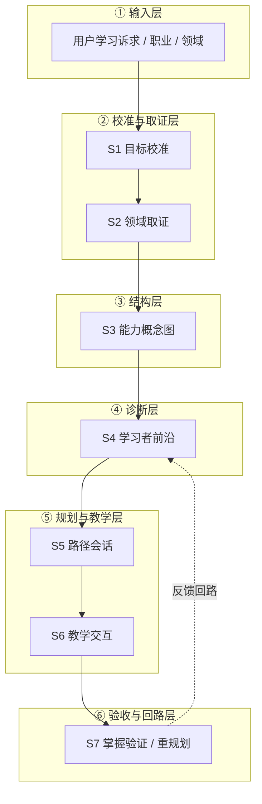
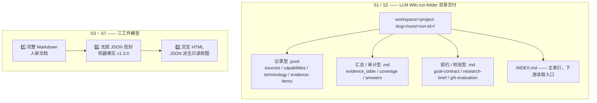
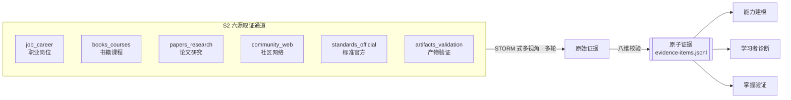
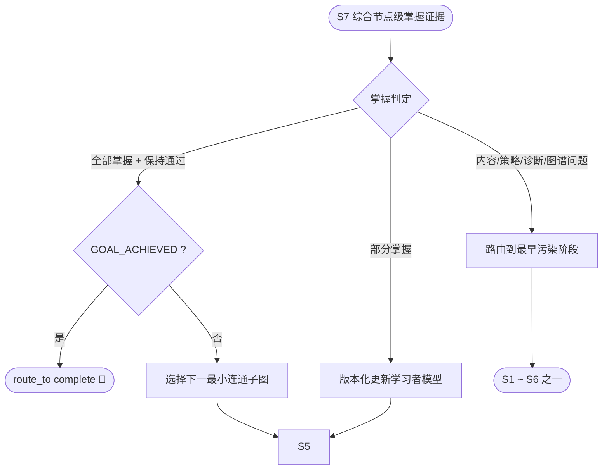
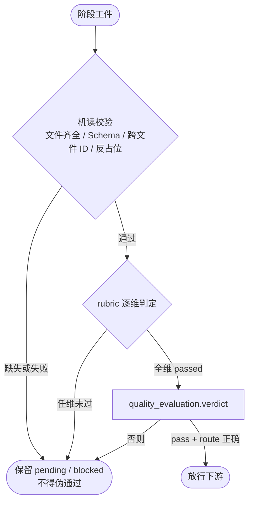
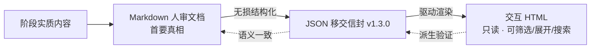
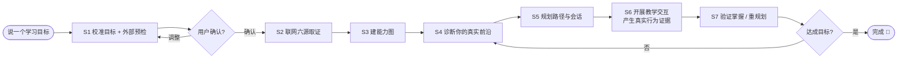

# Prova Learn · 证据驱动的个性化学习系统

> **Evidence-driven, agent-native personalized learning as seven composable Skills.**
> 把"学习一个目标"这件事，拆成七个可独立调用、可串联、可返工的 AI agent 技能（Skill），每一步都有独立质量门把关。


-teal)


---

## 目录

- [这是什么](#这是什么)
- [为什么这样设计](#为什么这样设计)
- [系统总览：七阶段流水线](#系统总览七阶段流水线)
- [核心概念](#核心概念)
- [七阶段详解](#七阶段详解)
- [阶段交付模型](#阶段交付模型)
- [证据如何流动](#证据如何流动)
- [掌握验证与重规划路由](#掌握验证与重规划路由)
- [质量门如何判定](#质量门如何判定)
- [三工件派生（S3–S7）](#三工件派生s3s7)
- [仓库结构](#仓库结构)
- [快速开始（使用说明）](#快速开始使用说明)
- [工具集成](#工具集成)
- [开发与验证](#开发与验证)
- [贡献](#贡献)
- [文档导航](#文档导航)
- [许可证](#许可证)

---

## 这是什么

**Prova Learn**（曾用名"自动学习"，现名"证据学习"）是一套**面向 coding agent 的个性化学习方法论与可执行契约**。它不是一个一次性的"课程生成器"，而是一条持续运转的学习回路：

```text
目标校准 → 领域取证 → 结构建模 → 学习者诊断
→ 路径规划 → 教学交互 → 掌握验证与重规划
```

它以 **Skill 契约、JSON Schema、HTML 模板、eval、OpenSpec** 为主要实现载体——没有服务端、数据库或前端应用。每个阶段都是一个自包含的 agent skill，可以单独调用，也可以首尾相接跑完整条学习链。

> 适合：想用 AI agent 真正"学会"某个能力（而非只是得到一份提纲）的个人学习者、教研人员、教育产品设计师。

---

## 为什么这样设计

大多数"AI 学习"体验的通病是：**把模型记忆当成知识、把"一次答对"当成掌握、把搜索数量当成证据质量**。Prova Learn 用三条不可降级的纪律来纠正它：

| 纪律 | 含义 |
|---|---|
| **证据驱动** | 冷启动与关键决策必须真实联网取证；模型知识只能产生假设和检索词，不能代替外部证据。 |
| **质量门（Gate）把关** | 每个阶段都有独立质量门；`pending` / `blocked` / 证据不足必须如实保留，**绝不为继续流程而伪造通过**（fail-closed）。 |
| **行为优于自述** | 不代写学习者回答；"说懂了"、一次答对、单题得分都不能单独证明掌握——要看推理、提示依赖、迁移与保持。 |

---

## 系统总览：七阶段流水线

七个阶段 `S1–S7`，每段后面跟着一个质量门 `G1–G7`。任何一门未过，都会**路由回最早失效的阶段**返工，而不是硬往下走。


分层视角看，整个系统由六层职责构成：



---

## 核心概念

- **`Sx`（Stage）**：第 x 个执行阶段。
- **`Gx`（Gate）**：紧随 `Sx`、判断该阶段工件能否被下游消费的质量门。
- **`GOAL_ACHIEVED`**：只有 S7 判定 `GOAL_ACHIEVED` 且最终验收与保持要求通过，才能 `route_to=complete`。**`G7` 工件合格 ≠ 学习者已掌握。**
- **证据角色**：`model_hypothesis` / `market_signal` / `external_evidence` / `user_provided_unverified` / `learner_behavior`。其中 `model_hypothesis` 与 `user_provided_unverified` **不计为**已验证外部证据。
- **安全态**：`pending`、`blocked`、`unknown`、`evidence_insufficient`、`research_blocked`、`not_executed`、`version_conflict`——这些状态必须保留真实语义，不得强制改成 `pass`。

> ⚠️ "已通过 `Gx`"不能由文件存在、裸 `positive_artifact` 或自然语言声明推断。完整校验清单见 [`AGENTS.md` §4.1](AGENTS.md)。

---

## 七阶段详解

| 阶段 | Skill | 回答的问题 | 正向工件 | 正常路由 |
|---|---|---|---|---|
| **S1** | `create-goal-success-contract` | "学会"到底是什么样的可观察证据？ | `goal_success_contract`（run folder） | G1 → S2 |
| **S2** | `create-domain-evidence-landscape` | 证据支持对这个领域的哪些回答？ | S2 run-folder 阶段区 | G2 → S3 |
| **S3** | `build-capability-concept-graph` | 这个能力的**结构**是什么？ | `capability_concept_graph` | G3 → S4 |
| **S4** | `diagnose-learner-frontier` | 学习者现在**从哪里**开始学？ | `learner_snapshot` | G4 → S5 |
| **S5** | `plan-learning-sessions` | 下一步学什么、为什么、怎么学？ | `learning_and_session_plan` | G5 → S6 |
| **S6** | `run-instructional-interaction` | 这一节具体怎么教、怎么练？ | `session_package_and_trace` | G6 → S7 |
| **S7** | `verify-mastery-and-replan` | 学会了吗？没学会下一步路由到哪？ | `mastery_and_replanning_bundle` | G7 → S1~S7 或 complete |

**确认策略**：S1、S5 为 `mandatory`（未确认不得前进）；S2、S3、S4、S7 为 `conditional`（高风险时升级为强制）；S6 以 `inform` 为主，但必须有**真实学习者交互**。

---

## 阶段交付模型

两类阶段，两种落盘方式：



- **S1 / S2**：一个 run folder 内含固定命名文件，由**状态机带 guard** 控制写入顺序，**稳定 ID 跨文件互引**（如 `S001` / `CAP-001` / `RQ-###`）。S2 不新建独立 run，而是在同一已过 G1 的 run 下追加 `s2/` 阶段区。
- **S3–S7**：严格按 **Markdown → JSON → HTML** 顺序交付，三者语义必须一致；HTML 是 JSON 的派生只读视图，不接受业务输入。

---

## 证据如何流动

S2 通过**六个强制证据通道**取证，每条结论都要追溯到一个可访问的原始或权威来源。百科与搜索结果页只是入口，不是终点。



**八维校验**：来源覆盖 · 证据角色分离 · 来源独立性 · 可靠性/权威性 · 时效/地区适配 · 冲突平衡 · 可观察相关性 · 边界/缺口透明。

---

## 掌握验证与重规划路由

S7 是一个完整的**反馈事务**：验证结果必须被原子地写回学习者模型，并产生明确的下一个动作。它会把"本次答对"和"长期掌握"分开，并区分问题来源（内容 / 策略 / 诊断 / 图谱 / 来源 / 目标）。



> 没有真实后端时，学习者模型更新写 `not_executed`；版本冲突时不应用补丁。

---

## 质量门如何判定

质量门不是"跑通了就行"。它先做**机读结构校验**，再做**rubric 逐维判定**，任一不过都 fail-closed。



---

## 三工件派生（S3–S7）



Markdown、JSON、HTML **任一缺失或派生验证失败**，都不能报告"本阶段交付完整完成"。

---

## 仓库结构

```text
prova_learn/
├── .agents/
│   ├── skills/                          # ① 七阶段 Skill（执行阶段任务的第一入口）
│   │   ├── s1-create-goal-success-contract/
│   │   ├── s2-create-domain-evidence-landscape/
│   │   ├── s3-build-capability-concept-graph/
│   │   ├── s4-diagnose-learner-frontier/
│   │   ├── s5-plan-learning-sessions/
│   │   ├── s6-run-instructional-interaction/
│   │   └── s7-verify-mastery-and-replan/
│   │       ├── SKILL.md                 # 阶段契约与流程
│   │       ├── references/              # 阶段合同、JSON Schema、示例
│   │       ├── assets/stage-report.html # S3–S7 阶段 HTML 模板
│   │       └── evals/evals.json         # 正向 + 反向/阻断 eval
│   └── quality-checks/                  # ② 七阶段对应的质量检查 Skill
├── .claude/  .codex/  .cursor/          # ③ 各 agent 平台的 OpenSpec 工作流
├── AGENTS.md                             # ④ 仓库级运行协议与导航（权威）
├── docs/                                 # ⑤ SOP、调研、错误台账
│   ├── chat_log/
│   └── refer/
├── example/                             # ⑥ 真实 / 夹具化阶段产物
├── openspec/                             # ⑦ 需求、设计、规格、任务
│   ├── changes/
│   └── specs/
├── scripts/run_skill_evals.py            # ⑧ Skill eval 编排入口
├── workspace/                            # ⑨ 真实学习 run（含完整示例）
└── LICENSE                               # Apache-2.0
```

> 权威来源顺序发生冲突时，按 [`AGENTS.md` §2](AGENTS.md) 判断：用户当前指令 > 适用 `AGENTS.md` > 各 `SKILL.md` > OpenSpec change > 已实施文档 > 示例/eval > 会话历史。

---

## 快速开始（使用说明）

### 前置条件

- **一个支持的 coding agent**：Claude Code、Codex 或 Cursor（本仓库为三者都预置了 OpenSpec 工作流）。
- **Python 3**（仅在运行 eval 时需要）。
- agent 需具备**联网能力**——S1/S2 在冷启动、目标实质变化或关键证据过期时必须真实联网取证。

### 1. 安装

```bash
git clone https://github.com/kms9/prova-learn.git
cd prova-learn
```

Skill 固定位于 `.agents/skills/<skill-dir>/`，被各 agent 平台按其 skill 机制加载。无需额外全局安装。

### 2. 跑通第一个学习目标

整个系统从 **S1** 开始。在你的 agent 中，用一句话描述你想学会的能力，并触发目标校准：

> 例：*"我想系统学会 PostgreSQL 查询优化，目标是能独立诊断并优化生产环境的慢查询。"*

agent 会按以下回路推进（每个阶段都会先过自己的质量门）：



每个阶段的**触发场景**（当你想做的事匹配以下描述时，就进入对应 Skill）：

| 你想做的事 | 进入 |
|---|---|
| 开始新目标 / 改变目标 / 定义"学会"的证据 / 校正岗位名称 | **S1** |
| 领域全景 / 真实联网研究 / 六源取证 / 补来源空白 | **S2** |
| 能力大纲 / 学习单元 / 原子知识点 / 先修关系 / 测评图谱 | **S3** |
| "从哪开始学" / 误概念 / 提示依赖 / 迁移表现 / 争议节点复测 | **S4** |
| 学习路径 / 会话编排 / 时间节奏 / 首个会话合同 | **S5** |
| 真实教学会话 / 解释 / 正反例 / 支架 / 练习与反馈 | **S6** |
| 是否掌握 / 更新学习者模型 / 延迟复测 / 归因与重规划 | **S7** |

### 3. 查看一个真实示例

仓库自带一个完整跑通的 S1 + S2 run：

```bash
# 浏览 run folder 的主索引（下游阶段的读取入口）
cat workspace/senior-teaching-researcher/runs/run-20260727-234421/INDEX.md

# S2 阶段区入口
cat workspace/senior-teaching-researcher/runs/run-20260727-234421/s2/INDEX.md
```

这个 run 展示了一个 run folder 的标准结构：根目录的 S1 文件（`goal-contract.md`、`research-brief.md`、`g1-evaluation.md` 等）+ `s2/` 下的 S2 文件（`research-answers.md`、`answer-validation.md`、`g2-evaluation.md` 等）。

### 4. 运行 eval（校验 Skill 行为）

```bash
# 先看帮助与 dry-run
python3 scripts/run_skill_evals.py --help
python3 scripts/run_skill_evals.py --all --route dclaude --dry-run

# 真正执行（需要对应路由可用）
python3 scripts/run_skill_evals.py --all --route dclaude
```

> `--route` 指定外部模型路由（见下节）。eval 会跑每阶段的正向与反向/阻断用例，验证 Skill 在合法输入上通过、在阻断输入上 fail-closed。

---

## 工具集成

本仓库为多 agent 平台与多外部模型预置了路由。

**OpenSpec 工作流**（变更管理）：在每个 agent 平台目录下都有
`.claude/skills/openspec-*`、`.codex/skills/openspec-*`、`.cursor/skills/openspec-*`，提供：

| Skill | 用途 |
|---|---|
| `openspec-propose` | 提出一个新变更（proposal + design + specs + tasks） |
| `openspec-explore` | 探索 / 调研 / 澄清需求 |
| `openspec-apply-change` | 实施一个变更的任务 |
| `openspec-archive-change` | 归档已完成的变更 |

**外部模型路由**（旁路探索、交叉评审、eval）——节选，完整别名见 [`AGENTS.md` §9](AGENTS.md)：

| 别名 | 等价 | 用途 |
|---|---|---|
| `gclaude` | `claude --dangerously-skip-permissions` | Claude 主路由 |
| `dclaude` | `claude --settings .../deepseek.json ...` | DeepSeek 路由 |
| `grcursor` | `agent --model grok-4.5-xhigh` | Grok 只读分析 |
| `gecursor` | `agent --model gemini-3.1-pro` | Gemini 只读分析 |

> 主线程始终负责核对外部结果、实际文件、diff 与验证产物，再做最终汇总；不以主观等待时间判定失败，以退出码 / JSON / 日志为准。

---

## 开发与验证

改动前先运行与改动成比例的最小验证（完整清单见 [`AGENTS.md` §12](AGENTS.md)）：

```bash
# 基础检查：空白错误 + 所有 JSON 可解析 + OpenSpec 严格校验
git diff --check -- AGENTS.md .agents/skills openspec docs scripts
find .agents/skills -type f -name '*.json' -exec jq empty {} +
openspec validate --all --strict --no-interactive

# 七个 Skill 的结构校验
for skill_dir in .agents/skills/s{1,2,3,4,5,6,7}-*; do
  python3 "$HOME/.codex/skills/.system/skill-creator/scripts/quick_validate.py" "$skill_dir"
done
```

**修改纪律摘要**：搜索优先 `rg`；只改任务范围内文件；不用 `git reset --hard` 或大范围删除；Skill 固定放 `.agents/skills/`；新脚本前先征得同意；联网事实必须实际检索并保留来源。

---

## 贡献

欢迎通过 OpenSpec 提出变更：

1. 用 `openspec-propose` 写 proposal / design / specs / tasks；
2. 用 `openspec-apply-change` 实施，并更新任务与证据；
3. 用 `openspec-archive-change` 归档前做严格验证——区分"规格有效""实现完成""真实集成通过"。

请遵循项目的 **error-first** 记录习惯：遇到实质错误先登记到[错误台账](docs/chat_log/七阶段个性化学习Skill实施与评估错误记录.md)，再修复并保留原始症状。

---

## 文档导航

- [AGENTS.md](AGENTS.md) — 仓库级运行协议与权威导航（**入门必读**）
- [七阶段最终 SOP](docs/chat_log/个性化学习SOP步骤拆分最终结论.md)
- [六源信息收集建议](docs/chat_log/信息收集建议.md)
- [七阶段理论职责排查](docs/chat_log/个性化学习理论与七阶段策略归属排查.md)
- [S5 策略适配场景设计](docs/chat_log/S5基于学习者输出的学习策略检查与适配场景设计.md)
- [S3 大纲—知识点关联](docs/chat_log/大纲-知识点关联.md)
- [三工件 HTML 需求](docs/chat_log/七阶段Skill输出HTML可视化与交互需求.md)
- [实施与评估错误台账](docs/chat_log/七阶段个性化学习Skill实施与评估错误记录.md)
- [贯穿案例：PostgreSQL 查询优化](docs/chat_log/七步个性化学习SOP贯穿案例-PostgreSQL查询优化.md)
- [个性化教育理论基础](docs/refer/个性化教育理论基础和教学方法发展.md)

---

## 许可证

[Apache License 2.0](LICENSE) © kms9
