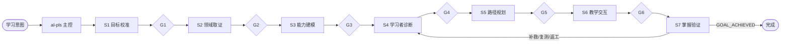

# Prova Learn · 证据驱动的个性化学习系统

> Evidence-driven, agent-native personalized learning through one orchestrator and seven composable Skills.

Prova Learn 把“学会一个目标”拆成一条可审计、可阻断、可返工的学习回路：

```text
目标校准 → 领域取证 → 能力建模 → 学习者诊断
→ 路径规划 → 真实教学交互 → 掌握验证与重规划
```

它不是课程提纲生成器，也不是一个自动把流程“跑完”的脚本。没有真实学习者回答、迁移或保持证据时，流程必须停在 `pending` 或 `blocked`。

## 核心原则

| 原则 | 含义 |
|---|---|
| 证据驱动 | 关键领域事实需真实访问来源；模型知识只产生假设和检索词。 |
| 行为优于自述 | “懂了”、年限、偏好、单题和一次总分不能单独证明掌握。 |
| Fail closed | 前置、确认、真实回答、版本或证据不足时不伪造通过。 |
| 诊断有效 | 复合任务必须拆成子项；节点结论绑定可观察指标。 |
| 模拟隔离 | fixture 与系统构造答案不能进入真实 learner model。 |
| 迁移与保持 | 关键能力用未见任务、迁移和适用的延迟复测验证。 |

## 系统结构



### 主控 `al-pls`

主控是薄控制面：

- 理解自然语言意图；
- 定位项目与 revision；
- 根据 `project-state.json.route_to` 选择阶段；
- 执行对应 Skill；
- 重新读取 Gate、verification 和 conversation；
- 在真实输入、mandatory 确认、pending、blocked、版本冲突或上游返工处停止。

主控不是 S0/G0，也不能替阶段补造工件。

## 七个阶段

| 阶段 | Skill | 核心问题 | 正常路由 |
|---|---|---|---|
| S1 | `al-s1-create-goal-success-contract` | “学会”对应什么真实场景和可观察证据？ | G1 → S2 |
| S2 | `al-s2-create-domain-evidence-landscape` | 领域结论由哪些独立证据支持？ | G2 → S3 |
| S3 | `al-s3-build-capability-concept-graph` | 能力如何拆成可诊断节点、先修和测评？ | G3 → S4 |
| S4 | `al-s4-diagnose-learner-frontier` | 学习者当前最近学习前沿在哪里？ | G4 → S5 |
| S5 | `al-s5-plan-learning-sessions` | 从前沿到目标的最小学习路径是什么？ | G5 → S6 |
| S6 | `al-s6-run-instructional-interaction` | 如何开展真实教学、提示、撤架与练习？ | G6 → S7 |
| S7 | `al-s7-verify-mastery-and-replan` | 是否掌握；缺口来自哪里；下一步是什么？ | G7 → S1–S7 / complete |

## 统一交付模型

当前版本的 S1–S7 全部使用同一个长期项目级 LLM Wiki：

```text
workspace/<project-slug>/
├── INDEX.md
├── PROJECT.md
├── project-state.json
├── timeline.md
├── conversations/
├── stages/
├── knowledge/
├── learner/
├── plans/
├── sessions/
├── assessments/
├── decisions/
├── attachments/
├── simulations/
└── _machine/
```

三层真相：

1. **Wiki Markdown**：当前被接受的含义和人审入口；
2. **JSONL events/records**：不可变历史；
3. **小型 JSON snapshots**：当前版本、route 和 active 指针。

S3–S7 的 JSON/HTML 是 compatibility exports 或只读派生视图，不是主要交付，也不能接收业务写入。

## Conversation 与 revision

每次实质交互创建：

```text
conversations/YYYY-MM/<conversation-id>/
├── INDEX.md
├── transcript.md
├── events.jsonl
└── summary.md
```

写入事务：

```text
读取 project_revision
→ 创建 conversation
→ 记录用户原文和工具结果
→ 更新阶段 Wiki/JSONL
→ 执行 Gate 与 verification
→ 再核对 revision
→ revision + 1
→ 同步 project-state、INDEX 和 timeline
```

revision 冲突时不得覆盖。

## S1：显式确认

S1 和 S5 是 mandatory confirmation 阶段。确认记录必须包含：

```json
{
  "status": "pending|confirmed",
  "confirmed_fields": [],
  "unconfirmed_fields": [],
  "learner_utterance": "...",
  "interpretation_basis": "explicit|explicit_accept_all_defaults|ambiguous"
}
```

普通“继续”“下一步”“跑完流程”不自动确认多个默认字段。只有上一轮明确列出全部字段，并提供“接受全部默认值”选项时，简短选择才能作为 bundled confirmation。

## S2：来源质量而非来源数量

六个研究通道是视角，不是分数：

- job/career；
- books/courses；
- papers/research；
- community/web；
- standards/official；
- artifacts/validation。

同一组织、多篇同源页面和转载链只算一个独立来源组。高影响统计、政策、合规和普遍性主张若无法追到 canonical 或原始依据，必须降级为 `trace_only`、`unverified` 或 `accepted_with_limitations`。

## S3：可诊断图谱

测评不是“一个大题覆盖很多节点”。每个测评项或子项至少记录：

```text
item/sub-item
→ observable indicator
→ node
→ threshold
→ independence requirement
→ minimum observations
→ confounds
→ remediation
```

默认掌握最小证据规则：

```text
tested_mastered =
  两项相互独立的有效观察
  OR
  一项完整表现任务 + 一项无提示迁移或延迟复测
```

S3 只定义规则，不推断学习者掌握。

## S4：短筛查与自适应探针

冷启动默认采用：

1. **8–12 分钟高信息短筛查**；
2. 只对冲突、猜对、关键先修不确定和提示依赖追加探针。

不要求一次覆盖全部节点；未测节点保持 `unknown`。G4 的目标是形成可用于规划的最近学习前沿，而不是制造形式上的 100% 覆盖。

## S5：从真实前沿规划

- `unknown` 不等于未掌握；
- 关键 unknown 使用短探针；
- 误概念使用对比和反例；
- 程序缺口使用 worked example、练习和撤架；
- 迁移失败使用变式；
- 保持不足使用间隔复测。

计划必须控制每节认知负荷，并在用户确认后才进入 S6。

## S6：真实交互

默认顺序：

```text
独立尝试 → 必要解释 → 正反例/表征
→ worked example → 有支架练习 → 撤架
→ 未见独立任务 → 迁移/保持
```

计划提示不等于实际提示。提示后修订正确只形成带提示依赖的候选证据。G6 评价教学过程和记录质量，不宣布掌握。

## S7：掌握、持久化与完成

S7 综合：

- correctness；
- reasoning quality；
- hint dependency；
- independence；
- transfer；
- confidence calibration；
- delayed retention。

没有 learner-model backend 时：

```text
update.status=not_executed
persistence=not_executed
active model version 不变
```

只有最终未见综合验收、必需迁移、保持和真实持久化全部通过，才允许 `GOAL_ACHIEVED` 与 `route_to=complete`。

## 模拟证据隔离

- 真实行为：`learner_behavior`；
- 系统构造或 fixture：`synthetic_learner_behavior` 或明确 fixture 元数据；
- `simulations/**` 不得进入真实 learner snapshot、mastery event、active model 或 project-state。

## 快速开始

```text
$al-pls 我想学会为 PostgreSQL 慢查询做可靠诊断
```

之后继续使用同一入口：

```text
$al-pls 继续
$al-pls 现在该做什么
$al-pls 修改目标：最终验收改为限时故障排查
```

主控会根据项目 route 选择阶段，并在需要真实回答或确认时直接展示任务。

## 验证

```bash
python3 scripts/validate_delivery_contract.py
python3 scripts/validate_delivery_contract.py \
  --project-dir workspace/forward-deployed-engineer

find .agents/skills -type f -name '*.json' -exec jq empty {} +
python3 -m py_compile scripts/validate_delivery_contract.py
```

仓库级 validator 会检查：

- manifest/profile/Skill 名称和前置一致；
- 八个 Skill 包含关键学习有效性约束；
- `workspace/AGENTS.md` 存在；
- project/conversation/stage 必需文件存在；
- JSONL 可解析且事件不可变；
- 真实项目不引用 `simulations/**` 或 `synthetic_learner_behavior`。

## 仓库导航

```text
.agents/
├── skills/
│   ├── al-orchestrate-personalized-learning/
│   ├── s1-create-goal-success-contract/
│   ├── s2-create-domain-evidence-landscape/
│   ├── s3-build-capability-concept-graph/
│   ├── s4-diagnose-learner-frontier/
│   ├── s5-plan-learning-sessions/
│   ├── s6-run-instructional-interaction/
│   └── s7-verify-mastery-and-replan/
├── project-workspace-contract.md
├── standalone-invocation-contract.md
├── stage-runtime-contract.md
├── stage-delivery-manifest.json
├── stage-profiles.json
├── project-state.schema.json
└── project-event.schema.json
```

## License

Apache License 2.0。
