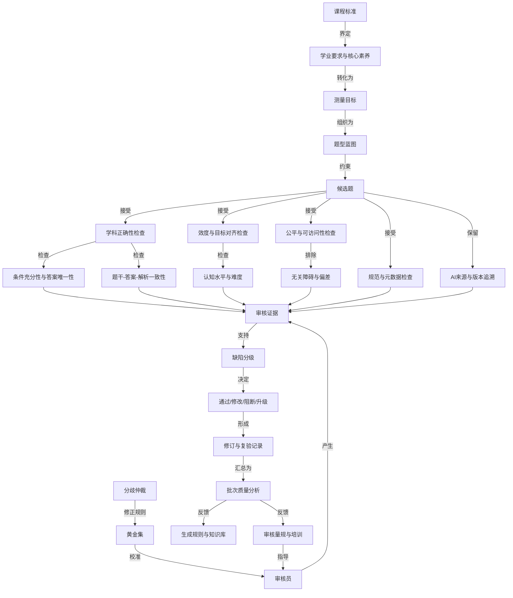

# 七步个性化学习 SOP 贯穿案例：资深学科内容校验老师

> 角色口径：**资深高中数学学科内容校验与教研质量老师（AI 题库方向）**  
> 检索日期：2026-07-27  
> 配套方法：[个性化学习 SOP 步骤拆分最终结论](./个性化学习SOP步骤拆分最终结论.md)  
> 概念地图方法：[如何制作概念地图](/Users/logo/tx_pan/self_work/DayLog/0topic/知识概念地图学习/方法论/02-概念地图怎么做.md)  
> 本文是一轮完整的教学模拟，不是招聘保证、行业认证或真实用人单位的录用标准。

## 1. 为什么需要先校正岗位名称

### 1.1 网络检索结论

公开招聘市场中，“资深校验老师”不是一个边界稳定的通用职位名称。相近工作通常分散在以下岗位：

- 题库审核老师、题库教研审核老师；
- 学科教研老师、资深教研员；
- 命题、审题专家；
- 教育内容审核、数字教育资源质检；
- AI 课程内容教研、AI 生成题目评测。

因此，不能从一个模糊名称直接推导学习方案。本文综合真实招聘样本与规范性文件，把目标角色限定为：

> 在高中数学 AI 题库场景中，能够依据课程标准、学科知识、测量原则、内容规范和产品要求，独立完成题目审核、缺陷定级、修改复验、批次质量分析、审核标准建设及校验团队标定的资深教研质量人员。

### 1.2 JD 样本与可用证据

| 来源类型 | 公开信息中的职责或要求 | 本案例采用方式 | 局限 |
|---|---|---|---|
| 招聘平台：高中学科题库/内容审核 | 当前样本中同时出现高中题库教研审核、高中数学教研和学科编审：要求控制内容质量、能独立处理知识性差错，常见筛选条件包括本科和 3–5 年经验 | 取这些相邻岗位的交集，作为一线学科审核任务样本 | 没有找到名称完全匹配的“高中数学资深校验老师”；聚合页会变化 |
| 招聘平台：资深教研岗位 | 研究教育理念和学习者问题，设计内容解决方案；部分 AI 教研岗位要求课程体系、知识图谱、题库建设和多年教研经验 | 补充“资深”层级的体系建设和产品协作职责 | 不同企业的资深层级差异较大 |
| 公共教研员选聘 | 要求较高教育教学理论水平、丰富教学实践、教学研究和组织能力；部分岗位要求教师资格、职称及命题审题经历 | 补充学科权威性、教研组织和示范培训能力 | 公共教研员不等同于互联网教育题库岗位 |
| 教育部命题意见 | 命题和审核人员分离；开展政治性、公平性、科学性、技术性、程序性及学科交叉审查 | 作为审核维度和职责分离的规范依据 | 面向学业水平考试，应用到商业题库时需按风险缩放 |
| 国家智慧教育平台内容审核规范 | 审核政治性、导向性、科学性、适用性、规范性、时效性、公益性，并覆盖知识产权、隐私、元数据等要求 | 扩展数字教育内容审核和合规能力 | 直接适用对象是国家智慧教育平台 |
| ETS 题目开发流程 | 题目要匹配测量目标，具有适当难度和认知水平，并经过内部、偏差与公平性、编辑及校对审查 | 补充效度、公平、认知水平和多轮审核 | 是国际测评机构实践，不能代替中国课标 |
| AERA 等测试标准 | 测试开发与使用要处理效度、信度/精度、公平性等专业技术问题 | 作为教育测量知识域的上位依据 | 本案例不把学习者培养成专业心理测量学家 |
| UNESCO 教师 AI 能力框架 | 强调以人为本、AI 伦理、AI 基础与应用、AI 教学法和专业学习 | 补充 AI 内容校验中的人类责任、伦理与工具判断 | 是能力框架，不是题库审核操作手册 |

### 1.3 从 JD 到能力要求，不能直接照抄

JD 同时混合了四种东西：

1. **工作任务**：审核题目、修改解析、建设题库；
2. **能力要求**：能判断、解释、修复并复验问题；
3. **背景筛选条件**：学历、教资、工作年限、职称；
4. **组织偏好**：责任心、沟通、抗压、协作。

本 SOP 只把能够通过学习和行为证据验证的部分建模为能力。年限、学历和职称保留为招聘背景条件，不伪装成完成课程后即可获得的能力。

## 2. 模拟场景与案例材料

### 2.1 学习者画像

模拟学习者“林老师”：

- 数学本科，持高中数学教师资格证；
- 有 4 年高中数学教学经验；
- 熟悉函数、几何、概率统计等高中数学内容；
- 能发现明显答案错误，但没有系统学习教育测量；
- 偶尔使用生成式 AI 备课，缺乏 AI 内容质量评测方法；
- 没有建立过审核量规、黄金集、团队标定或批次质量报告。

这些是案例假设，不代表真实用户现状。

### 2.2 工作任务

一家教育科技公司准备发布一批由 AI 辅助生成的高中数学练习题。林老师需要在沙箱中完成：

- 对 120 道候选题进行风险分层和审核；
- 对缺陷进行定位、定级、给证据并提出可执行修改；
- 对修改后的题目复验；
- 分析批次问题并提出生成、编辑和审核流程改进；
- 建立审核标准、黄金题集和新人标定材料；
- 向教研、产品和算法团队说明发布建议。

### 2.3 一个贯穿流程的候选题

```yaml
item_id: M-FUNC-017
grade: 高一
topic_tag: 函数定义域
stem: |
  已知函数 f(x)=√(x-1)/(x-2)，则函数的定义域是（  ）。
options:
  A: "[1,+∞)"
  B: "[1,2)∪(2,+∞)"
  C: "(1,2)∪(2,+∞)"
  D: "[1,2)"
key: A
explanation: |
  因为根号内 x-1>0，且分母 x-2≠0，
  所以 x>1 且 x≠2，定义域为 (1,2)∪(2,+∞)，故选 C。
declared_objective: 能根据偶次根式和分式的有意义条件求函数定义域
difficulty: easy
generator: model-v3.2
```

这道题至少存在：

- 标准答案 A 错误，正确答案应为 B；
- 解析把 `x-1≥0` 错写成 `x-1>0`，自身导向 C；
- 标准答案、解析结论互相不一致；
- 若只做字符串或答案一致性检查，可能漏掉数学条件错误；
- 认知目标主要是直接应用，不足以单独证明高阶数学推理能力。

### 2.4 缺陷分级

本案例使用以下内部等级；它们是模拟项目的验收规则，不宣称为行业统一标准：

| 等级 | 定义 | 示例 | 默认动作 |
|---|---|---|---|
| Critical | 可能造成严重合规、公平、安全或大规模错误发布 | 政治导向问题、明显歧视、泄题、核心事实系统性错误 | 阻断批次并升级 |
| Major | 题目不能有效、唯一、公平地测量目标 | 答案错误、多解、条件缺失、解析关键推理错误、课标错配 | 驳回修改后重审 |
| Minor | 不改变主要测量结论，但影响规范、可读性或体验 | 标点、公式排版、非关键冗余、标签轻微偏差 | 修改后抽检或复验 |
| Pass | 在当前用途和证据下满足发布门槛 | 目标匹配、答案和解析正确、无已知高风险问题 | 允许进入下一门 |

## 3. S1：目标与成功契约

### 3.1 输入契约校验

原始诉求：

> “我想成为资深校验老师，能够审核 AI 生成的数学题。”

缺失信息：

- “校验”是校对文字、审核学科内容，还是评价测量质量；
- 学段、学科、题型和产品场景；
- “资深”的可观察表现；
- 是否要求带团队、制定标准和分析数据；
- 学习时间和最终验收方式。

结论：原始诉求不能直接进入领域取证。

### 3.2 需求信息收集

S1 需要向学习者收集：

1. 主学科和可覆盖学段；
2. 既有教学、命题、审题或编辑经验；
3. 目标企业类型和工作内容；
4. 是否涉及 AI 生成内容；
5. 希望胜任单题审核、批次质量还是团队标准建设；
6. 每周时间、截止时间和可使用工具；
7. 能否接受盲审、复审和现场答辩。

### 3.3 确认交互

模拟确认结果：

```yaml
confirmation:
  mode: mandatory
  question: 是否将目标限定为高中数学AI题库的资深学科内容校验与教研质量岗位？
  response:
    subject: 高中数学
    content: AI辅助生成的选择题与解答题
    senior_scope:
      - 独立审核与修复
      - 批次质量分析
      - 审核标准建设
      - 新审核员标定
    learning_period: 12周
    weekly_budget: 8小时
  status: confirmed
```

### 3.4 正向输出：`goal_success_contract`

```yaml
artifact: goal_success_contract
schema_version: 1.0
target_role: 资深高中数学学科内容校验与教研质量老师（AI题库方向）
target_scenario: 对AI辅助生成的高中数学题进行审核、修复、复验和批次质量治理
duration: 12周
weekly_budget: 8小时
observable_capabilities:
  - 将题目追溯到课程目标、知识点和认知要求
  - 独立复算并验证题干、答案、解析和评分规则
  - 识别有效性、公平性、适配性、规范性、合规性和AI特有风险
  - 对缺陷分级，给出证据、修复方案和复验结果
  - 使用黄金集完成团队标定并解释分歧
  - 分析批次数据，定位根因并改进上游流程
final_assessment:
  blind_gold_set: 60题
  live_review_batch: 120题
  deliverables:
    - 审核量规
    - 单题审核记录
    - 修订与复验记录
    - 批次质量报告
    - 黄金集与标定说明
    - 跨团队发布建议
scenario_thresholds:
  critical_defect_recall: ">=95%"
  major_defect_recall: ">=90%"
  false_reject_rate_on_clean_items: "<=8%"
  expert_agreement_weighted_kappa: ">=0.80"
  critical_decisions_with_traceable_evidence: "100%"
exclusions:
  - 不承诺获得真实职位或“资深”职级
  - 不替代专业心理测量师的量表开发和统计验证
  - 不直接操作真实学生隐私数据
  - 不覆盖高中数学以外学科
```

以上数值是本模拟案例为制造明确反馈而设置的门槛，不是从招聘 JD 中抄出的行业统一值。

### 3.5 S1 质量门

| 检查项 | 证据 | 结果 |
|---|---|---|
| 目标可观察 | 六类能力均对应交付任务 | 通过 |
| 成功可判定 | 黄金集、实际批次、阈值和答辩均已定义 | 通过 |
| 边界明确 | 高中数学、AI 题库、12 周 | 通过 |
| 资历与能力分离 | 未承诺职称、年限或录用 | 通过 |
| 用户确认 | 强制确认已记录 | 通过 |

`G1 = pass`，进入 S2。

## 4. S2：领域取证与认知全景

### 4.1 输入契约校验

- `goal_success_contract` 已通过 G1；
- 目标学科、场景、交付物和排除项完整；
- 招聘信息只用于观察市场需求，不直接充当教学或测量事实；
- 课程、审核、测量、AI 和合规结论分别寻找相应来源。

### 4.2 取证问题

1. 当前相邻 JD 重复要求哪些任务和背景？
2. 高中数学题目应该依据什么课程目标和学业质量要求？
3. 一道题的“正确”之外，还需要审哪些质量维度？
4. 数字教育内容有哪些合规和审核要求？
5. AI 辅助生成内容新增了哪些风险与人类责任？
6. “资深”比普通审核员多出的可观察工作是什么？

### 4.2.1 条件确认交互

检索后向学习者展示两个可行口径：

```text
口径A：传统题库审校
重点是逐题正确性、解析、排版和入库。

口径B：AI题库教研质量
除逐题审核外，还包括AI来源追溯、批次风险、量规、标定和上游改进。
```

模拟学习者确认选择口径 B，并接受高中数学作为主学科。确认状态记录为：

```yaml
mode: conditional
trigger: 市场岗位名称不统一，存在两种能力边界
response: 选择AI题库教研质量口径
status: confirmed
assumptions_changed:
  - 从一般校对扩展为学科、测量、数字内容和AI质量
```

### 4.3 证据层级

| 层级 | 来源 | 主要用途 |
|---|---|---|
| A | 教育部课程标准、命题意见、数字教育资源审核规范 | 法规政策、课程和审核边界 |
| A | AERA/APA/NCME 测试标准、ETS 题目开发公开流程 | 教育测量和题目开发原则 |
| A | UNESCO 教师 AI 能力框架 | AI 伦理、人类责任和教师能力 |
| B | 官方教研员选聘和学校考试管理制度 | 资深教研、审题流程的实践要求 |
| C | 智联、BOSS 等当前招聘聚合页 | 市场岗位语言和常见筛选条件 |
| D | 博客、培训宣传、二手转述 | 只用于发现线索，不支撑关键结论 |

### 4.4 证据到结论映射

| 结论 | 主要来源 | 置信度与边界 |
|---|---|---|
| 市场相邻岗位要求题库准确性、规范性和学段适配性 | 当前题库审核招聘样本 | 中；岗位页会变化 |
| 资深教研需要课程体系、内容方案、教研组织和指导能力 | 资深教研招聘样本、教研员选聘 | 中高；组织之间定义不同 |
| 审核不能只检查答案，还需政治性、公平性、科学性、技术性和程序性 | 教育部命题意见 | 高；高风险考试要求需按商业场景缩放 |
| 数字资源审核包含科学性、适用性、规范性、时效性、知识产权和隐私 | 国家智慧教育平台审核规范 | 高；直接适用范围有限 |
| 高质量题目应匹配目标，具有适当难度与认知水平，并接受公平和编辑审查 | ETS 题目开发流程 | 高；需结合中国课标本地化 |
| 测评质量需要考虑效度、信度/精度与公平 | AERA/APA/NCME 测试标准 | 高 |
| AI 教育应用必须保留人类能动性、问责和伦理判断 | UNESCO 教师 AI 能力框架 | 高 |
| 高中数学内容和评价应追溯到现行课程标准 | 教育部 2017 年版 2020 年修订课程标准 | 高 |

### 4.5 领域知识要求

#### A. 高中数学学科知识

- 函数、几何与代数、概率与统计、数学建模等内容结构；
- 数学抽象、逻辑推理、数学建模、直观想象、数学运算、数据分析；
- 定义、定理和适用条件；
- 等价变形、边界值、特殊值、反例和多解检查；
- 常见错误概念与解题路径。

#### B. 课程与教学知识

- 课程标准、学业质量和教材边界；
- 学习目标、内容、活动与评价对齐；
- 学段适配、认知负荷和语言可读性；
- 典型误概念、反馈和解析设计；
- 题目对教学的正向或负向反拨。

#### C. 教育测量与题目质量

- 测量目标、构念和效度论证；
- 信度/评分一致性和测量误差；
- 难度、区分度、选项功能和异常作答；
- 公平、偏差、可访问性和无关难度；
- 双向细目表、题型蓝图和覆盖率；
- 评分量规、开放题多路径答案和部分得分；
- 试测、复审、等值与版本控制的基本概念。

#### D. 内容审核与编辑

- 事实与学科正确性；
- 题干条件的充分性、必要性和唯一性；
- 答案、解析、标签和元数据一致性；
- 数学符号、单位、图表、排版和语言规范；
- 来源、版权、隐私、广告和时效；
- 版本差异、修改记录和可追溯性。

#### E. AI 内容评测

- 生成式模型可能产生的幻觉、模式化错误和自洽假解释；
- 同一提示、模型和知识源造成的系统性相关错误；
- 检索来源、模型版本、提示版本和生成批次追溯；
- 黄金集、对抗样例、抽样、人机协作与复验；
- 不能把语言流畅度、模型置信表达或多数投票等同于正确；
- 人类最终责任、学生权益、偏差和隐私保护。

#### F. 质量系统与资深能力

- 缺陷分类、风险分级和发布门；
- 单审、双审、抽检、分歧仲裁和升级机制；
- 审核员标定、一致性监控和漂移复标；
- 批次指标、Pareto 分析和根因分析；
- 把缺陷反馈给提示、知识库、生成规则和产品流程；
- 编写量规、培训新人并主持跨团队质量决策。

### 4.5.1 JD—能力—知识—证据转换

| JD/规范中的任务语言 | 转换后的可观察能力 | 需要掌握的知识 | 不能只靠什么证明 | 掌握证据 |
|---|---|---|---|---|
| 审核题库准确性、规范性、适配性 | 独立复算，识别学科、结构、教学和编辑缺陷 | 高中数学、课标、教学、编辑规范 | “细心”“责任心”自述 | 陌生题盲审及修复复验 |
| 剔除错误、冗余内容 | 区分错误、低价值重复和合理变式 | 构念、题型蓝图、认知水平、重复与覆盖 | 只做文本查重 | 去留决策及目标覆盖说明 |
| 建设课程体系、知识图谱和题库 | 将目标、概念、任务、题目和资源建立追溯 | 课程设计、知识概念地图、元数据 | 画一张无连接词的目录图 | 可读命题、跨链接及资源索引 |
| 开展命题、审题和质量分析 | 从单题判断扩展到数据、批次和测量解释 | 效度、难度、区分度、公平、试测 | 总正确率 | 批次报告、异常解释及限制 |
| 使用 AI 工具或审核 AI 内容 | 识别模型特有错误并设计人机复核 | AI 基础、幻觉、追溯、黄金集、对抗验证 | “会写提示词” | 同源缺陷簇和上游改进实验 |
| 组织教研、培训和指导教师 | 建立量规，主持标定、仲裁和复盘 | 一致性、成人学习、反馈、会议决策 | 个人审核速度 | 团队标定前后数据和仲裁记录 |
| 跨团队推动内容质量 | 把缺陷转为产品、算法和流程可执行措施 | 根因分析、风险沟通、版本和发布门 | 提交问题列表 | 改进方案、责任人、指标和复验 |

本案例把“资深”操作化为四个增量，而不是简单等同于工作年限：

1. 能处理边界模糊、证据冲突和高风险题；
2. 能建立标准并校准他人，而不只保证自己判断正确；
3. 能从单题上升到批次、系统和上游根因；
4. 能对发布决策负责并向不同角色解释证据和限制。

### 4.6 正向输出：`domain_evidence_landscape`

```yaml
artifact: domain_evidence_landscape
scope:
  role: 资深高中数学学科内容校验与教研质量老师
  product: AI辅助生成题库
  jurisdiction: 中国大陆数字教育内容场景
consensus:
  - 单题审核必须覆盖学科正确性、目标匹配、一致性、适配性和规范性
  - 高风险发布需要职责分离、复审、记录和升级
  - 资深能力包含标准建设、批次分析、标定和流程改进
  - AI生成内容必须保留人工问责并建立来源及版本追溯
open_questions:
  - 商业练习题与高风险考试应采用多严格的双审比例
  - 不同题型的统计指标和样本量门槛如何设置
  - 企业实际使用哪个高中数学教材版本和地区考试要求
evidence_gaps:
  - 未获得目标企业内部真实JD和审核SOP
  - 未获得真实生产题库、学生数据和缺陷分布
  - 招聘平台聚合页可能变化或截断
```

### 4.7 S2 质量门

- 关键结论均有来源类别，未把招聘广告当成科学标准；
- 中国课标、数字内容规范与国际测量原则分开使用；
- 明确记录岗位名称不统一和企业内部数据缺口；
- 场景阈值被标记为教学设计，而不是网络事实；
- 若后续进入真实企业，应返回 S2，用该企业 JD、题库和 SOP 局部替换。

`G2 = pass_with_gaps`，允许进入 S3；真实组织适配仍是待执行门。

## 5. S3：能力—知识概念图建模

### 5.1 输入契约校验

- S1 目标和 S2 证据均可追溯；
- 不在 S3 发明新的招聘事实；
- 同时建立面向人理解的标准知识概念地图和面向编排的能力图；
- 标准领域地图与学习者个人地图分开。

### 5.1.1 建模需求与条件确认

建模前需要确定：

- 地图以“审核流程”还是“高中数学知识目录”为主轴；
- 节点粒度是否足以支持诊断和路径规划；
- 是否把招聘背景条件放进能力图；
- 是否同时维护人类可读地图与机器可编排能力图。

模拟决定：

```yaml
focus: 从候选题到发布决策的质量链
subject_taxonomy: 作为下层资源挂载，不在主图展开全部高中数学
background_filters:
  - 学历
  - 教资
  - 工作年限
placement: role_profile_only
placement_in_capability_graph: false
dual_view:
  canonical_knowledge_concept_map: true
  capability_concept_graph: true
confirmation:
  mode: conditional
  status: acknowledged
```

### 5.2 标准知识概念地图

#### 焦点问题

> 资深高中数学学科内容校验老师，如何把一批候选题转化为可解释、有效、公平、可教学、可追溯并可发布的题目？

#### 概念停车场

1. 课程标准
2. 学业质量
3. 数学核心素养
4. 测量目标
5. 构念
6. 题型蓝图
7. 学科正确性
8. 条件充分性
9. 唯一性
10. 答案—解析一致性
11. 难度
12. 区分度
13. 效度
14. 信度/一致性
15. 公平与偏差
16. 可访问性
17. 内容规范
18. 元数据
19. 缺陷分级
20. 审核证据
21. 黄金集
22. 审核员标定
23. 分歧仲裁
24. AI 生成追溯
25. 批次质量闭环

#### 核心命题

| 编号 | 概念 A | 连接词 | 概念 B |
|---|---|---|---|
| P1 | 课程标准 | 规定 | 学习内容和学业要求的边界 |
| P2 | 学业质量 | 帮助定义 | 测量目标 |
| P3 | 测量目标 | 通过 | 题型蓝图得到覆盖 |
| P4 | 题目 | 必须对齐 | 测量目标 |
| P5 | 学科正确性 | 依赖 | 定义、条件、推理与反例验证 |
| P6 | 条件充分性 | 支撑 | 答案唯一性 |
| P7 | 答案—解析一致性 | 不能替代 | 独立复算 |
| P8 | 效度 | 约束 | 分数可以支持什么解释 |
| P9 | 信度/一致性 | 反映 | 评分和判断的稳定程度 |
| P10 | 公平与可访问性 | 减少 | 与目标无关的作答障碍 |
| P11 | 缺陷分级 | 决定 | 修复、阻断或升级路径 |
| P12 | 审核证据 | 支撑 | 可追溯的发布决策 |
| P13 | 黄金集 | 用于 | 审核员标定与漂移监测 |
| P14 | AI 生成追溯 | 帮助识别 | 批量相关错误 |
| P15 | 批次质量分析 | 反馈到 | 生成规则、知识库与审核流程 |
| P16 | 分歧仲裁 | 处理 | 合理专家判断差异 |
| P17 | 教学适配 | 连接 | 学习者特征与解析反馈 |
| P18 | 资深校验 | 不仅审核单题还要建设 | 质量系统 |

#### Mermaid 主图



#### 关键跨链接

1. `课程标准 → 测量目标 → 公平审查`：公平不是独立做“敏感词检查”，而是判断与目标无关的语言、背景或表现形式是否改变作答机会。
2. `AI 来源追溯 → 批次质量分析 → 题型蓝图`：同一个提示造成的错误可能集中污染某个知识点或题型，因此 AI 追溯会影响覆盖和发布决策。
3. `黄金集 → 审核员标定 → 信度/一致性`：资深老师不只是自己判得准，还要让团队在同一规则下稳定判断。

### 5.3 能力图

| 节点 | 可观察能力 | 关键先修 | 掌握证据 |
|---|---|---|---|
| C1 课标追溯 | 将题目映射到学段、主题、要求和认知水平 | 高中数学知识 | 映射表及引用 |
| C2 数学独立复核 | 不依赖给定答案，复算并寻找边界和反例 | C1 | 审核记录、反例 |
| C3 题目结构审查 | 判断条件、唯一性、选项和解析一致性 | C2 | 缺陷定位和修复稿 |
| C4 教学适配 | 判断语言、认知负荷、误概念和反馈质量 | C1、C3 | 学习者适配说明 |
| C5 测量质量 | 判断目标对齐、效度风险、难度、区分度和评分一致性 | C1、基础统计 | 数据分析和测量论证 |
| C6 公平合规 | 识别偏差、可访问性、版权、隐私和内容规范风险 | C1 | 风险清单及升级 |
| C7 AI 内容评测 | 追踪模型/提示/来源，构造对抗检查并识别相关错误 | C2、C3、C6 | AI 缺陷簇报告 |
| C8 审核决策 | 缺陷分级，给证据、修复、复验和路由 | C2–C7 | 盲审一致性 |
| C9 批次质量治理 | 统计缺陷，做根因分析并推动上游改进 | C8 | 批次报告和改进验证 |
| C10 标准与团队建设 | 建量规、黄金集、标定和仲裁机制 | C8、C9 | 培训与标定结果 |

### 5.4 资源索引

```yaml
concept_resource_index:
  课程标准:
    - 普通高中数学课程标准（2017年版2020年修订）
  数字内容审核:
    - 国家智慧教育平台数字教育资源内容审核规范
  命题审题:
    - 教育部关于加强初中学业水平考试命题工作的意见
  题目开发:
    - ETS Item Development
  教育测量:
    - Standards for Educational and Psychological Testing
  AI教师能力:
    - UNESCO AI Competency Framework for Teachers
```

### 5.5 正向输出

```yaml
artifacts:
  - canonical_knowledge_concept_map
  - capability_concept_graph
  - concept_resource_index
  - map_quality_report
version: 1.0
learner_overlay: null
```

### 5.6 S3 质量门

| 维度 | 检查 | 结果 |
|---|---|---|
| 焦点问题 | 明确角色、对象和发布目标 | 通过 |
| 命题可读性 | 18 条边均可读成命题 | 通过 |
| 层级 | 课标—目标—题目—审核—决策—闭环清楚 | 通过 |
| 跨链接 | 课程、公平、AI、团队一致性之间有解释性连接 | 通过 |
| 目标覆盖 | 六类 S1 能力均映射到 C1–C10 | 通过 |
| 可追溯 | 核心概念连接 S2 来源类别 | 通过 |
| 地图分离 | 标准地图未混入林老师的诊断结论 | 通过 |

`G3 = pass`，进入 S4。

## 6. S4：学习者诊断与学习前沿

### 6.1 输入契约校验

- C1–C10 均有行为任务；
- 不用“教了几年”直接替代能力证据；
- 诊断题包含明显错误、隐蔽错误、无错误题和需要升级的题；
- 记录正确性、证据质量、提示次数、耗时和置信度。

### 6.2 诊断任务

| 任务 | 行为要求 | 主要观测节点 |
|---|---|---|
| D1 审核 `M-FUNC-017` | 独立复算、列缺陷、定级、修复并复验 | C2、C3、C8 |
| D2 课标映射 | 给三道函数题映射学习要求和认知水平 | C1 |
| D3 解析审查 | 比较两个都能得到正确答案的解析，判断教学质量 | C4 |
| D4 题目数据 | 根据正确率、上下组表现和选项分布诊断题目 | C5 |
| D5 公平与合规 | 审核含复杂文化背景、学生信息和图片来源的题 | C6 |
| D6 AI 缺陷簇 | 比较同一提示生成的 20 道题，识别系统性错误 | C7、C9 |
| D7 分歧主持 | 对两名审核员的不同定级给出仲裁 | C10 |
| D8 学习者概念图 | 画出“从候选题到发布”的关系图并解释连接词 | 全图 |

### 6.3 模拟行为证据

#### D1 结果

林老师：

- 发现标准答案 A 错误；
- 给出正确集合 `[1,2)∪(2,+∞)`；
- 将题目判为 Major；
- 没有单独记录解析把 `≥0` 写成 `>0`；
- 没有检查题目标签、认知水平和批次同源风险；
- 置信度 95%，耗时 4 分钟。

结论：数学求解强，但“得到正确答案”仍代替了多维审核。

#### D4 结果

给定某题 200 人试答数据：

```yaml
key: B
overall_correct: 0.78
upper_group_correct: 0.92
lower_group_correct: 0.66
option_distribution:
  A: 0.06
  B: 0.78
  C: 0.15
  D: 0.01
```

林老师只判断“难度较低”，没有识别 D 几乎不工作的干扰项，也没有询问样本代表性、目标用途和上/下组定义。

#### D8 学习者地图

学习者初始地图：

```text
课程标准 → 知识点 → 做题 → 检查答案 → 修改错题 → 发布
```

与标准地图比较后发现：

- 缺少测量目标、效度和公平；
- 缺少答案—解析—元数据一致性；
- 缺少缺陷分级、升级和复验；
- 缺少黄金集、审核一致性和批次闭环；
- 把“做题正确”误当成“题目质量充分”。

### 6.4 正向输出：`learner_snapshot`

```yaml
artifact: learner_snapshot
learner: 林老师
mastered:
  C2_数学独立复核:
    confidence: high
    evidence: 能复算并给出边界条件
developing:
  C1_课标追溯:
    issue: 能标知识点，不能稳定标认知目标和学业要求
  C3_题目结构审查:
    issue: 易漏解析、标签和元数据之间的不一致
  C4_教学适配:
    issue: 反馈多基于教学直觉，缺少显式量规
not_mastered:
  C5_测量质量:
    issue: 不会结合用途解释难度、区分度和选项功能
  C6_公平合规:
    issue: 只注意明显敏感内容，忽略无关难度与来源
  C7_AI内容评测:
    issue: 逐题看，不追踪模型和提示导致的相关错误
  C9_批次质量治理:
    issue: 没有指标、根因和闭环经验
  C10_标准与团队建设:
    issue: 未做过黄金集、标定和仲裁
learning_frontier:
  - C1_课标追溯
  - C3_多维题目结构审查
misconceptions:
  - 数学答案正确即可发布
  - 正确率可以直接代表题目质量
  - AI题目和人工题目只需使用相同的逐题检查
learner_concept_map_overlay:
  missing_propositions:
    - 测量目标约束题目
    - 公平减少无关障碍
    - AI追溯帮助识别批量相关错误
    - 黄金集用于审核员标定
```

### 6.5 确认交互

向学习者展示：

> 你已经具备较强的高中数学复核能力。主要差距不是“多做几道数学题”，而是把单题求解升级为目标对齐、多维审核、AI 批次治理和团队质量系统。是否同意学习路径先补课标追溯和结构化审核，再进入测量、AI 和质量治理？

模拟回复：同意，但希望保留足够真实题目练习。

### 6.6 S4 质量门

- 每个结论都能回到具体任务；
- 自述和年限没有覆盖行为证据；
- 已掌握与未掌握均有证据；
- 学习前沿是可学习节点，而不是最终大目标；
- 标准地图和学习者覆盖层分开保存。

`G4 = pass`，进入 S5。

## 7. S5：路径与会话规划

### 7.1 输入契约校验

- 优先利用已掌握的数学能力；
- 不重复安排完整高中数学课程；
- 路径覆盖 C1、C3–C10；
- 每一阶段都有真实审核工件和退出证据；
- 总预算为 12 周 × 8 小时。

### 7.2 路径选择

```text
阶段A 课标与结构化审核
  C1 → C3 → C4

阶段B 测量、公平与合规
  C5 ↔ C6

阶段C AI内容评测与审核决策
  C7 → C8

阶段D 批次质量与资深能力
  C9 → C10
```

### 7.3 正向输出：`learning_and_session_plan`

| 周 | 主题 | 主要活动 | 正向工件 | 退出证据 |
|---|---|---|---|---|
| 1 | 课标到测量目标 | 建立函数模块双向细目表 | 课标追溯表 | 10 题映射 ≥9 题合理 |
| 2 | 题目结构审核 | 条件、唯一性、答案和解析一致性 | 单题审核模板 | 20 题 Major 召回达门槛 |
| 3 | 教学适配 | 认知水平、误概念、反馈和语言 | 解析质量量规 | 能解释两种解析优劣 |
| 4 | 效度与蓝图 | 构念、目标对齐、覆盖和无关难度 | 题型蓝图 | 识别错配并给替代方案 |
| 5 | 题目数据 | 难度、区分度、选项和评分一致性 | 数据诊断报告 | 不脱离用途解释指标 |
| 6 | 公平与合规 | 偏差、可访问性、版权、隐私和升级 | 风险清单 | Critical 路由无遗漏 |
| 7 | AI 错误机制 | 幻觉、自洽错误、来源和版本追溯 | AI 风险模型 | 找出同源缺陷簇 |
| 8 | 对抗与复验 | 边界值、特殊值、替代求解、工具校验 | 对抗检查集 | 修复后独立复验 |
| 9 | 缺陷分级 | 证据、严重度、修改和发布门 | 审核决策包 | 与专家一致性达标 |
| 10 | 批次分析 | 指标、Pareto、根因和上游反馈 | 批次质量报告 | 建议可验证 |
| 11 | 黄金集与标定 | 量规、锚题、分歧和漂移 | 标定工作坊 | 团队一致性提升 |
| 12 | 综合项目 | 120 题批次审核和管理层汇报 | 最终交付包 | 通过 G7 |

### 7.4 会话模板

每次会话统一为：

```text
5分钟：检索前测
10分钟：展示本次目标和质量标准
15分钟：带解释的 worked example
20分钟：半完成审核
25分钟：独立审核或批次任务
15分钟：对比、反馈和概念图修订
10分钟：延迟检索任务与下一步确认
```

### 7.5 强制确认

模拟确认：

- 接受 12 周路径；
- 每周至少保留 4 小时真实题目审核；
- 同意最终使用盲审黄金集，而非只提交自己挑选的作品；
- 同意将 AI 工具输出保留为待验证材料，不作为最终证据。

### 7.6 S5 质量门

- 路径由诊断缺口驱动；
- 每周都有具名工件和门槛；
- 学习、练习、反馈和延迟验证均被安排；
- 时间不够时优先保留 C1、C3、C5、C6、C8，不能只学工具；
- 用户完成时间和验收方式确认。

`G5 = pass`，进入 S6。

## 8. S6：内容生产与教学交互

本节展开第 2 周“题目结构审核”的一节完整会话，并展示如何使用概念地图。

### 8.1 输入契约校验

```yaml
required:
  - learner_snapshot.G4 == pass
  - learning_and_session_plan.G5 == pass
  - C1课标追溯完成基础练习
  - 本次题目均为沙箱材料
session_goal:
  - 不依赖给定答案完成独立复核
  - 同时检查题干、答案、解析、标签和元数据
  - 给出缺陷级别、证据、修复和复验
```

### 8.1.1 告知后继续

会话开始前向学习者说明：

> 本次材料全部来自沙箱。你需要先独立判断，之后才会看到参考审核；过程记录用于更新学习者模型。可以使用计算器或符号工具复核，但必须说明输入、输出和人工验证。

学习者未提出异议，状态记为 `acknowledged`。如果学习者指出题目本身标注有争议，先保留其证据并进入仲裁，不把“与参考答案不同”自动判错。

### 8.2 检索前测

问题：

1. 对分式与偶次根式组成的函数，定义域需要同时满足什么条件？
2. “答案与解析一致”为什么不能证明题目正确？
3. 多选项中有两个等价正确答案时属于什么风险？

林老师第 1 题回答正确，第 2 题只能说“可能一起错”，第 3 题没有明确发布路由。

### 8.3 Worked example：审核 `M-FUNC-017`

#### 第一步：遮住答案和解析

独立求解：

```text
x - 1 ≥ 0
x - 2 ≠ 0
所以 x ≥ 1 且 x ≠ 2
定义域为 [1,2)∪(2,+∞)
```

#### 第二步：逐字段对照

| 字段 | 检查 | 结论 |
|---|---|---|
| 题干 | 条件足以形成唯一答案 | 是 |
| 选项 | B 与独立结果一致，选项互斥 | 是 |
| 标准答案 | 标为 A | 错 |
| 解析条件 | 把 `≥0` 写成 `>0` | 错 |
| 解析结论 | 得到 C，与标准答案 A 冲突 | 错 |
| 目标标签 | 函数定义域 | 基本对齐 |
| 难度 | 单步组合条件 | easy 合理，但需结合目标人群 |
| AI 追溯 | model-v3.2，尚缺 prompt 和知识源版本 | 追溯不完整 |

#### 第三步：缺陷定级

```yaml
decision: reject_and_revise
severity: Major
defects:
  - code: KEY_INCORRECT
    evidence: 独立求解得到B
  - code: EXPLANATION_MATH_ERROR
    evidence: 偶次根式要求被写成x-1>0
  - code: KEY_EXPLANATION_CONFLICT
    evidence: key=A但解析结论=C
  - code: TRACEABILITY_INCOMPLETE
    evidence: 缺少prompt和知识源版本
```

#### 第四步：修复

```yaml
key: B
explanation: |
  偶次根式有意义要求 x-1≥0，即 x≥1；
  分式有意义还要求 x-2≠0，即 x≠2。
  因此定义域为 [1,2)∪(2,+∞)，故选 B。
```

#### 第五步：复验

- 使用边界值 `x=1` 验证可取；
- 使用排除值 `x=2` 验证不可取；
- 使用区间内外代表值验证集合；
- 再次检查 key、解析末句和选项一致；
- 更新版本和修改记录。

### 8.4 半完成练习

```yaml
item_id: M-STAT-031
stem: 某班40名学生数学平均分为80分，因此该班超过一半学生的成绩高于80分。该结论（  ）。
options:
  A: 一定正确
  B: 一定错误
  C: 可能正确也可能错误
  D: 无法计算平均分
key: C
objective: 理解平均数不能决定数据在均值两侧的人数
```

要求学习者补全：

1. 构造一个使“超过一半高于 80”成立的数据分布；
2. 构造一个使其不成立的数据分布；
3. 判断题目是否测到目标概念；
4. 检查“可能正确也可能错误”和“无法判断”之间的措辞；
5. 给出适合高一学生的解析。

反馈只在学习者提交反例后给出，不直接展示答案。

### 8.5 对比例题

比较两份解析：

```text
解析A：平均数不能反映每个人的分数，所以选C。

解析B：平均数只约束总和，不决定有多少数据位于平均数之上。
例如，21人得81分、19人适当低于80分时，可以有超过一半高于80；
反过来，少数高分也可以把多数低分的平均数拉到80。
因此仅凭平均数无法确定人数比例，选C。
```

学习者需要说明：

- 两者答案都正确；
- B 用正反构造支持概念理解；
- A 过于笼统，不能帮助排除常见误解；
- “解析正确性”和“解析教学质量”是两个维度。

### 8.6 AI 批次扩展

提供同一提示生成的 20 道定义域题，要求：

1. 按根式、分母、对数真数和复合条件分组；
2. 检查是否重复出现把 `≥0` 写成 `>0`；
3. 统计该错误在批次中的比例；
4. 判断只修改当前一道题是否足够；
5. 给出上游改进：
   - 提示中加入边界条件核对；
   - 生成后运行符号或数值边界测试；
   - 增加包含端点的黄金题；
   - 对同一模型/提示批次扩大抽检。

### 8.7 概念地图修订任务

学习者在自己的图中补充：

```text
独立复算 → 发现 → 答案和解析的共同错误
边界值 → 检验 → 条件是否误用
AI来源追溯 → 聚合同源题 → 发现批量相关错误
复验 → 确认 → 修复没有引入新缺陷
```

这不是让学习者照抄标准地图，而是要求其用本次证据解释每条连接。

### 8.8 正向输出：`session_package_and_trace`

```yaml
artifact: session_package_and_trace
session: W2-S2
outputs:
  - M-FUNC-017完整审核记录
  - M-STAT-031半完成审核
  - 两份解析对比报告
  - 20题AI批次缺陷簇分析
  - learner_concept_map_overlay_v2
interaction_trace:
  prompts_used: 2
  corrections:
    - 从只改答案扩展为逐字段审核
    - 从单题错误扩展为同源批次风险
  unresolved:
    - 缺陷严重度在不同产品用途下的变化
```

### 8.9 S6 内容质量门

- worked example 展示决策过程，不只给最终答案；
- 练习与目标能力直接对齐；
- 学习者必须先产出，再获得解释；
- 正例、反例、边界值和批次迁移同时出现；
- AI 工具没有替代独立数学验证；
- 概念地图通过解释性连接被更新；
- 会话工件可进入 S7，而非只记录“完成学习”。

`G6 = pass`，进入 S7。

## 9. S7：掌握验证、模型更新与重规划

### 9.1 输入契约校验

- 验证材料没有直接重复教学示例；
- 黄金集同时包含 Critical、Major、Minor 和无缺陷题；
- 专家标签含证据和允许争议范围；
- 最终评价不只看总准确率；
- 能区分学习者错误、题目标注错误和量规缺陷。

### 9.2 第一次盲审

60 题黄金集组成：

| 类型 | 数量 |
|---|---:|
| Critical 缺陷题 | 10 |
| Major 缺陷题 | 24 |
| Minor 缺陷题 | 10 |
| 当前用途下可通过题 | 16 |

模拟结果：

```yaml
critical_detected: 10/10
major_detected: 20/24
clean_items_false_rejected: 2/16
weighted_kappa_with_expert: 0.76
evidence_complete_on_critical: 10/10
```

虽然 Critical 全部发现，但：

- Major 召回率为 83.3%，低于 90%；
- 无缺陷题误拒率为 12.5%，高于 8%；
- 与专家加权一致性为 0.76，低于 0.80。

不能因为“总共判断对很多题”而通过。

### 9.2.1 条件确认与异议处理

系统向学习者展示逐题差异，而不是只显示三个分数。学习者可以对专家标签提出证据化异议：

```yaml
mode: conditional
trigger: 学习者与黄金集在6题上结论不同
process:
  - 学习者先说明目标用途、风险和依据
  - 第二专家在不知道原标签的情况下复核
  - 确认是学习者错误、黄金集错误或量规歧义
result:
  learner_error: 4
  gold_set_error: 0
  rubric_ambiguity: 2
status: confirmed_after_review
```

上表指标是仲裁前初算。两道量规歧义题不作为新增的个人负面证据，并进入 C10 的量规修订任务；对无歧义题重新计算后，三项指标仍未达到对应门槛。用户异议可以触发复核，但不能用自述直接覆盖行为证据。

### 9.3 `mastery-verifier` 输出

```yaml
artifact: mastery_verdict
status: not_yet_mastered
passed:
  - C2数学独立复核
  - C3题目结构审查
  - C6高风险合规升级
  - C7AI同源缺陷识别
gaps:
  - node: C4教学适配
    evidence: 把两个可接受的开放表达误判为不规范
  - node: C5测量质量
    evidence: 对目标用途改变后的难度判断不稳定
  - node: C8审核决策
    evidence: Major和Minor边界不稳定
route_to: S5
```

### 9.4 模型更新与路径补丁

```yaml
learner_model_patch:
  C4:
    state: developing
    next_task: 对比“风格偏好”和“影响测量的表达缺陷”
  C5:
    state: developing
    next_task: 同一题在练习、诊断和选拔三种用途下分别判断
  C8:
    state: developing
    next_task: 使用12道边界锚题进行严重度标定
plan_patch:
  duration: 2周
  activities:
    - 用途敏感的效度判断
    - Major/Minor/Pass边界锚题讨论
    - 先独立判断再仲裁
```

更新是原子操作：保留第一次失败证据、版本化 learner overlay，并只修改必要节点。

### 9.5 第二次 S5→S6→S7 循环

补救活动：

- 同一道统计题分别用于形成性练习、单元诊断和高风险选拔；
- 讨论何时“题目简单”是合理设计，何时是目标错配；
- 比较 12 道严重度边界题；
- 要求每次误拒都写出“如果发布会造成什么具体伤害”；
- 修订缺陷量规中的 Major/Minor 判例。

第二次 30 题等值集结果：

```yaml
critical_detected: 5/5
major_detected: 12/13
clean_items_false_rejected: 0/8
weighted_kappa_with_expert: 0.86
```

局部掌握门通过，但仍需最终综合项目。

### 9.6 最终综合项目

林老师对 120 题模拟生产批次完成：

1. 风险分层和抽检方案；
2. 逐题审核及证据记录；
3. 26 道题修改与复验；
4. AI 来源和提示版本聚类；
5. 缺陷 Pareto 和根因分析；
6. 发布、阻断和升级建议；
7. 20 道黄金题及标定说明；
8. 30 分钟跨团队汇报与答辩。

此外，使用一套未出现在教学和第一次验证中的 60 题等值黄金集进行最终盲审。其构成为 10 道 Critical、24 道 Major、10 道 Minor 和 16 道当前用途下可通过题。

批次主要发现：

| 缺陷簇 | 数量 | 根因判断 | 上游措施 |
|---|---:|---|---|
| 边界条件遗漏 | 9 | 生成提示缺少端点与特殊值检查 | 增加边界测试和黄金题 |
| 答案—解析冲突 | 6 | 生成后字段独立更新 | 增加跨字段一致性门 |
| 认知目标标高 | 5 | 用题面长度代替认知水平 | 改为按实际推理过程标注 |
| 干扰项无功能 | 4 | 批量套模板 | 使用典型误概念生成并试测 |
| 来源/图片记录不全 | 2 | 元数据字段非必填 | 发布前强制来源门 |

### 9.7 最终正向输出：`mastery_and_replanning_bundle`

```yaml
artifact: mastery_and_replanning_bundle
final_status: pass_for_defined_simulation
evidence:
  blind_gold_set:
    critical_recall: 100%
    major_recall: 91.7%
    false_reject_rate: 6.25%
    weighted_kappa: 0.84
  live_batch:
    reviewed: 120
    revised_and_reverified: 26
    critical_decisions_with_evidence: 100%
  senior_outputs:
    rubric: completed
    gold_set: completed
    calibration_session: completed
    batch_root_cause_report: completed
    cross_team_readout: completed
learner_map_change:
  added:
    - 效度限制分数解释
    - 公平减少无关障碍
    - 黄金集校准审核员
    - AI追溯连接批次根因
  corrected:
    - 答案正确不等于题目有效
remaining_limits:
  - 只验证了高中数学AI题库场景
  - 未使用真实学生数据和生产系统
  - 未验证其他学科、地区教材和高风险正式考试
next_route:
  - 真实企业适配时返回S1/S2更新目标、JD和内部SOP
  - 跨学科迁移时返回S3扩展领域地图
```

这里的 `pass_for_defined_simulation` 只表示达到 S1 已确认的模拟目标，不表示已经获得真实组织的“资深”职级。

### 9.8 S7 质量门

| 检查 | 结果 |
|---|---|
| 使用新的盲审材料，而非原题复述 | 通过 |
| 同时检查召回、误拒、一致性和证据 | 通过 |
| 第一次未达门槛时没有强行判定掌握 | 通过 |
| 路径只补缺口，没有重学全部课程 | 通过 |
| 标准地图与学习者地图分别版本化 | 通过 |
| 最终结论写明适用范围和未运行门 | 通过 |

`G7 = pass_for_defined_simulation`。

## 10. 七步移交总表

| 阶段 | 核心输入 | 正向输出 | 质量门 | 失败路由 |
|---|---|---|---|---|
| S1 | 模糊职业诉求 | `goal_success_contract` | 目标可观察、用户确认 | 留在 S1 |
| S2 | 目标契约 | `domain_evidence_landscape` | 来源、边界和缺口透明 | S2 补证 |
| S3 | 目标和证据 | 标准知识地图、能力图、资源索引 | 命题、跨链接和追溯成立 | S2/S3 |
| S4 | 能力图和诊断任务 | `learner_snapshot`、学习者地图覆盖层 | 行为证据支持结论 | S3/S4 |
| S5 | 诊断快照 | `learning_and_session_plan` | 路径最小且可验收 | S4/S5 |
| S6 | 会话计划 | `session_package_and_trace` | 先产出、再反馈、能迁移 | S5/S6 |
| S7 | 新掌握证据 | `mastery_and_replanning_bundle` | 达门槛并正确更新模型 | S4/S5/S6 或 S1–S3 |

## 11. 这个案例相对 PostgreSQL 案例增加了什么

1. **职业名称校正**：先通过 JD 检索发现岗位名不统一，再确定可执行角色。
2. **JD 与能力分离**：年限、学历和教资不被误写成学习结果。
3. **双图结构**：同时维护标准知识概念地图和学习者概念地图覆盖层。
4. **多种质量真相**：招聘需求、课程规范、测量标准、AI 伦理和企业门槛分别取证。
5. **复合掌握证据**：既看单题正确，也看效度、公平、误拒、团队一致性和质量闭环。
6. **资深层级可观察**：通过量规、黄金集、标定、仲裁和根因改进体现，而不是只写“经验丰富”。
7. **失败后真实重规划**：第一次黄金集未通过，S7 只回补 C4、C5、C8。

## 12. 来源

### 12.1 招聘与岗位样本

- [智联招聘：高中教研及题库审核相关岗位](https://www.zhaopin.com/zhaopin/835735d8839d4f68b4bfef6fe71a9296/)
- [BOSS 直聘：深圳资深教研员相关岗位聚合页](https://m.zhipin.com/zhaopin/42d6e2d17305d26103d-3dq1Eg~~/)
- [内江市教育科学研究所公开选调教研员公告](https://www.njpta.org.cn/newsDetail/14272.html)

### 12.2 中国课程、命题与数字内容规范

- [教育部：普通高中课程方案和学科课程标准（2017 年版 2020 年修订）](https://www.moe.gov.cn/srcsite/A26/s8001/202006/t20200603_462199.html)
- [普通高中数学课程标准（2017 年版 2020 年修订）PDF](https://www.pep.com.cn/xw/zt/rjwy/gzkb2020/202205/P020220517519489596282.pdf)
- [教育部：关于加强初中学业水平考试命题工作的意见](https://hudong.moe.gov.cn/srcsite/A06/s3321/201911/t20191128_409951.html)
- [教育部：国家智慧教育平台数字教育资源内容审核规范](https://www.moe.gov.cn/srcsite/A16/s3342/202407/t20240703_1139248.html)

### 12.3 教育测量、题目开发与 AI 教师能力

- [ETS：K–12 Item Development](https://www.ets.org/k12/capabilities/item-development.html)
- [AERA：Standards for Educational and Psychological Testing](https://www.aera.net/Publications/Books/Standards-for----Educational-Psychological-Testing-2014-Edition)
- [UNESCO：AI Competency Framework for Teachers](https://www.unesco.org/en/articles/ai-competency-framework-teachers)

### 12.4 本地知识概念地图方法论

- [如何制作概念地图](/Users/logo/tx_pan/self_work/DayLog/0topic/知识概念地图学习/方法论/02-概念地图怎么做.md)
- [AK 元模板如何应用到概念地图](/Users/logo/tx_pan/self_work/DayLog/0topic/知识概念地图学习/方法论/05-AK元模板如何应用到概念地图.md)
- [概念地图的对比与启发](/Users/logo/tx_pan/self_work/DayLog/0topic/知识概念地图学习/方法论/06-对比与启发.md)

## 13. 证据和实施限制

- 招聘聚合页是 2026-07-27 的网页快照，职位可能下线或内容改变；
- 没有找到一个被行业广泛采用、名称完全一致的“资深校验老师”官方 JD；
- 本文对相邻岗位的综合是分析推导，不是任何一家公司的原文职位说明；
- 文中的黄金集、缺陷数量、学习者表现和指标结果都是教学模拟；
- 真正用于招聘准备时，应以目标公司的最新 JD、面试流程和作品要求重跑 S1–S3；
- 真正用于生产发布时，还需接入企业内部内容政策、法务要求、数据权限和审核系统。
